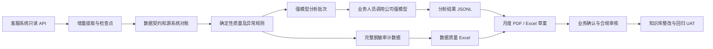

# AI 客服上线后数据质量与持续运营方案

> 文档状态：业务设计已确认，下一阶段为 IT 可行性评审与实施计划
> 设计日期：2026-07-11
> 适用范围：AI 客服上线后的客户反馈数据导出、数据质量控制、强模型辅助分析、月度报告和知识库整改闭环

## 1. 执行摘要

本方案不建设能够自主分析并修改生产知识库的 AI Agent。公司当前可用于自动任务的模型能力不足，若先由弱模型分类和总结，可能把错误判断固化到中间数据，后续使用强模型也难以纠正。

项目改为建设一条只读、可审计的数据订阅与导出管线：系统从客服 API 或只读数据库增量取得已经脱敏的交互数据，执行确定性校验、对账、分层筛选和模型批次编排，生成完整审计数据、数据质量报告以及供公司强模型分析的标准数据包。强模型只产生分析草案；业务、IT 和合规人员保留全部审批和生产变更权限。

预估月度数据量为 10,000–100,000 条“用户问题—客服回答”记录。前 3 个月采用每日确定性检查、每周人工强模型风险复核和月度正式报告；稳定后将常规强模型复核改为月底一次，每日确定性检查继续保留。

## 2. 已确认的设计决策

1. 数据源支持 API 或数据库只读访问，优先使用 API。
2. 上游系统负责脱敏，本项目默认输入已经完成公司要求的脱敏处理。
3. 本项目不设计新的数据保存期限或企业级脱敏标准。
4. 管线不使用弱模型进行分类、聚类、风险判断或报告生成。
5. 强模型由业务人员在公司环境中人工调用。
6. 生产系统、知识库和合规规则均不向本项目提供写权限。
7. 月度正式报告通过邮件发送给业务负责人和 IT，附件为 PDF 和 Excel。
8. 完整脱敏明细不通过邮件传输，存放在公司受控目录或内部数据平台。
9. 强模型输出默认是“待业务确认”的分析草案，不直接计入正式错误率。
10. 前 3 个月每周复核高风险数据；连续 3 个月无 P0、数据质量稳定且问题率下降后，可改为月底集中复核。

## 3. 目标与非目标

### 3.1 目标

- 持续、完整地取得上线后的脱敏客户交互和反馈数据。
- 证明导出数据与源系统一致，且没有静默遗漏、重复或字段漂移。
- 为 10,000–100,000 条月度记录建立可追溯、可分批的强模型分析输入。
- 及时发现可由确定性规则识别的生产异常。
- 用统一 PDF/Excel 月报支撑知识库优化和回归 UAT。
- 对每条发现保留从月报结论到源记录、知识库版本、整改和回归结果的完整链路。

### 3.2 非目标

- 不让模型自动发布答案或修改生产知识库。
- 不让模型自动改变合规规则、阈值或业务审批结论。
- 不用弱模型对全部客户对话做语义判断。
- 不把强模型建议直接视为已确认错误。
- 不在本项目中重新定义公司脱敏政策和数据保存政策。
- 不建设实时 BI 平台、工单平台或自动审批系统；数据量和协作复杂度显著增加后再单独立项。

## 4. 角色与职责

| 角色 | 主要职责 |
|---|---|
| 业务负责人 | 确认指标、运行强模型复核、判断问题是否成立、批准知识库建议、签发月报 |
| IT | 提供只读接口、数据字典和知识库版本；建设、运行和监控数据管线；定位技术异常 |
| 合规 | 审核需要合规判断的案例、测试集和知识库变更；不作为全部日常邮件的默认收件人 |
| 数据管线 | 增量提取、对账、字段校验、确定性规则、分批、清单、质量报告和邮件发送 |
| 公司强模型 | 对经过筛选的数据批次提供主题、风险、根因、知识库建议和测试用例草案 |

P0 确定性预警默认发送给业务负责人和 IT。业务负责人判断后，涉及合规的事件再进入公司正式合规流程。

## 5. 总体架构与数据流

### 5.1 权限边界

- 数据管线使用专用只读服务账号。
- 生产知识库、客服配置和合规规则不存在写入凭证。
- 强模型只读取公司受控环境中的脱敏分析批次。
- 原始脱敏全量数据、模型批次、模型输出和月报使用不同访问层级。
- 所有生产变更通过现有业务、IT 和合规流程执行。

## 6. 数据源契约

推荐“一行对应一个用户问题及其客服回答”。同一会话使用匿名会话 ID 和轮次序号保持顺序。若源系统采用消息事件表，可在导出层组装为问答对，同时保留事件引用。

### 6.1 必需字段

| 字段 | 说明 | 质量要求 |
|---|---|---|
| `record_id` | 稳定且唯一的交互记录编号 | 非空、100% 唯一 |
| `event_time` | 用户问题进入系统的时间 | 可解析、带时区或统一时区 |
| `session_id_anon` | 已匿名化的会话编号 | 同一会话保持一致 |
| `user_input_masked` | 已脱敏用户原始输入 | 非系统事件不得为空 |
| `assistant_output_masked` | 已脱敏客服实际输出 | 空值必须具有明确状态码 |
| `message_status` | 成功、空回复、系统错误等状态 | 使用受控枚举 |
| `fallback_type` | 无兜底、业务兜底、转人工等 | 使用受控枚举 |
| `handoff_flag` | 是否转人工 | 布尔或受控枚举 |
| `feedback_value` | 满意、一般、不满意、投诉或无反馈 | 使用受控枚举 |
| `source_record_ref_hash` | 授权 IT 可用于反查的源记录引用 | 不得暴露生产主键 |

### 6.2 强烈建议字段

| 字段 | 价值 | 缺失时的降级方法 |
|---|---|---|
| `turn_no` | 准确重建多轮会话 | 按会话、时间和消息类型推断，并设置 `sequence_inferred=true` |
| `matched_qa_id` | 定位具体知识条目 | 用返回文本指纹反查，设置 `qa_id_inferred=true` |
| `intent_id` | 判断路由和混淆意图 | 仅做文本分析，不声称已定位后台意图 |
| `kb_version` | 判断问题发生时的知识库状态 | 使用知识库生效时间快照推断并标记 |
| `response_time_ms` | 评估性能 | 从客服质量报告中移除响应时延指标 |
| `channel` | 按渠道分层 | 统一标记为 `UNKNOWN`，不做渠道比较 |
| `language` | 按语言分层 | 由强模型批次分析时识别并标记为推断 |

### 6.3 上线前 IT 必须完成的接口确认

- 是否能够导出逐轮问答以及会话轮次顺序。
- 是否能够提供 `matched_qa_id`、`intent_id` 和 `kb_version`。
- API 分页、速率限制、时间窗口和晚到数据规则。
- 客户反馈、投诉和转人工数据是否在同一接口中。
- 公司强模型允许的单文件大小、文件数量和总上下文限制。

上述建议字段缺失不会阻止原型，但所有推断值必须带推断标志，不能冒充源系统事实。

## 7. 月度数据产品

每个周期使用唯一 `export_id`，推荐格式为 `CS-OPS-YYYYMM-RNN`。

### 7.1 完整审计数据

- 保存本周期全部脱敏交互，不做抽样。
- 首选 Parquet；同时按周或文件大小生成 UTF-8 CSV。
- 保持会话完整，不跨文件拆分同一会话。
- 存放在受控目录，不作为邮件附件。

推荐文件：

- `interactions_YYYYMM.parquet`
- `interactions_YYYYMM_w01.csv` 等分区文件
- `feedback_YYYYMM.csv`
- `kb_snapshot_YYYYMM.csv`
- `export_manifest_YYYYMM.json`

### 7.2 数据质量工作簿

`data_quality_report_YYYYMM.xlsx` 至少包含：

- `00_使用说明`
- `01_Export_Manifest`
- `02_Reconciliation`
- `03_Field_Completeness`
- `04_Duplicates`
- `05_Session_Rebuild`
- `06_KB_Linkage`
- `07_Exceptions`
- `08_Schema_Changes`

### 7.3 强模型分析数据包

- `analysis_batch_001.csv` 等批次文件。
- `batch_manifest.csv` 记录批次、记录范围、选择原因和数量。
- 固定分析 Prompt 和结构化输出契约。
- 每个强模型输出保存为 `analysis_result_001.jsonl`。
- 汇总结果必须保留 `record_id`、`finding_id` 和批次编号。

单批建议为 1,000–3,000 轮，最终上限根据公司强模型实际限制调整。批次切分以完整会话为边界。

## 8. 数据质量规则和发布门

### 8.1 硬性发布门

- `record_id` 唯一率等于 100%。
- 源系统记录数与导出记录数对账差异等于 0；明确排除项必须单列说明。
- 时间字段有效率不低于 99.9%。
- 必需字段及枚举符合当前数据契约。
- 文件清单中的文件大小、记录数和 SHA-256 与实际文件一致。
- 字段结构变化经过显式版本升级，不能静默忽略。

任何硬性发布门失败时，不发布正式数据包。邮件只发送失败说明和影响范围。

### 8.2 质量观察指标

- 问答关联成功率。
- 会话顺序重建率。
- `matched_qa_id`、`intent_id` 和 `kb_version` 覆盖率。
- 客户反馈关联率。
- 推断字段占比。
- 晚到数据数量。
- 上游明显脱敏异常的隔离数量。

建议字段覆盖不足记录为质量问题，但在降级字段和标志完整时不必阻止原型运行。

## 9. 分层筛选与强模型分析

强模型不逐条读取全部 10,000–100,000 条正常记录。分析覆盖原则如下：

1. 100% 数据执行确定性校验和统计。
2. 100% 差评、投诉、转人工、兜底、空回复、未知输出、重复失败和高风险规则命中记录进入强模型批次。
3. 其余正常记录按问答 ID、业务类别、时间、渠道和知识库版本分层抽样。
4. 对每个问答 ID 保留最低样本量；低频高风险意图不得因样本少而被排除。
5. 强模型发现异常后，针对相关问答 ID、时间段或知识库版本扩大分析范围。
6. 全量审计数据始终保留，抽样只影响强模型语义分析范围。

### 9.1 强模型输出限制

强模型只能：

- 提出主题、风险、根因和影响范围假设。
- 建议新增、扩展、合并、停用知识条目或调整兜底。
- 生成回归测试用例草案。
- 汇总已经确认的指标。

强模型不能：

- 修改业务审批状态。
- 将自己的判断写成已确认错误。
- 修改知识库、生产配置或合规规则。
- 在缺少证据 ID 时产生正式发现。

## 10. 运行节奏

### 10.1 每日自动任务

- 拉取增量数据并更新检查点。
- 执行对账、唯一性、字段和枚举检查。
- 检查空回复、系统错误、未批准输出和重复异常。
- 监控兜底率、转人工率和差评率是否发生显著突变。
- 生成运行日志和确定性 P0 候选邮件。

### 10.2 每周强模型复核，前 3 个月

- 自动准备全部异常、高风险记录和少量正常对照样本。
- 业务负责人使用公司强模型运行固定 Prompt。
- 模型结果导入发现清单，状态固定为“待业务确认”。
- 业务负责人决定驳回、确认、升级合规或交由 IT 定位。

### 10.3 月度正式运行

- 冻结当月导出窗口并处理晚到数据。
- 生成完整审计数据和数据质量工作簿。
- 生成分层批次并完成强模型分析。
- 业务审核强模型发现并形成正式指标。
- 输出 PDF 管理报告和 Excel 明细。
- 通过邮件发送给业务负责人和 IT。
- 将确认问题转为知识库整改项和回归 UAT 用例。

### 10.4 稳定期转换条件

同时满足以下条件后，可将每周强模型复核改为月底一次：

- 连续 3 个月没有确认的 P0。
- 连续 3 个月所有数据质量硬门通过。
- 关键问题率没有连续恶化。
- 知识库变更和异常积压处于业务可管理范围。

每日确定性任务不因进入稳定期而停止。

## 11. 确定性预警及其边界

可自动预警的事实包括：

- 实际输出为空、系统错误或未知状态。
- 在严格白名单模式下，实际输出不属于批准知识库或兜底话术。
- 已知高风险意图命中明确禁止的问答 ID。
- 同一错误在短时间内集中出现。
- 兜底率、转人工率或差评率超过已批准阈值。
- 数据接口或知识库版本关联发生系统性故障。

这些规则不能可靠识别隐晦的语义错答、意图漂移或复杂合规风险，因此前 3 个月必须保留每周强模型复核。自动邮件中的语义风险只能标为“候选”，不能写为确认事件。

## 12. 月度报告设计

### 12.1 PDF 管理报告

正式 PDF 建议为 8–12 页：

1. 执行摘要。
2. 数据范围和数据质量结论。
3. 客服表现及环比趋势。
4. 知识库表现和高问题问答 ID。
5. 客户反馈主题和匿名案例。
6. 风险、异常和 P0/P1 状态。
7. 整改建议、责任人和计划时间。
8. 回归 UAT 结果及下月重点。

### 12.2 Excel 明细

- `00_使用说明`
- `01_Data_Quality`
- `02_KPI_Summary`
- `03_QA_Performance`
- `04_Exceptions`
- `05_Customer_Feedback`
- `06_KB_Recommendations`
- `07_Regression_Cases`
- `08_Action_Tracker`
- `09_Definitions`

### 12.3 发现记录契约

每条发现必须包含：

- `finding_id`
- `record_id` 或一组证据记录 ID
- 知识库版本和问答 ID，若不可用则明确标记推断状态
- 证据摘要
- 问题类型和影响数量
- 严重等级
- 来源：规则、强模型或人工
- 状态：待业务确认、已确认、驳回、整改中、待回归、已关闭
- 业务审批人和审批时间
- 合规审核状态
- 整改动作和回归结果

只有“已确认”的发现进入正式错误率。模型建议和候选问题单独统计。

## 13. 错误处理和恢复

| 场景 | 处理方式 |
|---|---|
| API 超时或临时故障 | 指数退避重试；超过次数后失败并告警 |
| 任务中断 | 从最近成功检查点继续，不重复发布 |
| 重复运行同一窗口 | 幂等生成；记录新的运行批次但保持记录内容一致 |
| 必需字段缺失 | 整批停止发布并通知 IT |
| 建议字段缺失 | 使用规定降级方案并在质量报告中标记 |
| 数据对账失败 | 停止正式发布，保留诊断文件 |
| API 字段结构变化 | 停止任务，升级数据契约后重新运行 |
| 会话无法重建 | 保留记录，标记质量异常，不静默删除 |
| 批次生成中断 | 从批次清单恢复并校验全量覆盖 |
| 强模型输出格式错误 | 拒绝导入，使用同一批次和固定 Prompt 重新生成 |
| 邮件发送失败 | 保留报告，重试邮件并记录投递状态 |

晚到数据使用固定回看窗口处理。跨月补录必须在下一期清单中明确标记原始业务月份，避免重复计入趋势。

## 14. 测试和验收

### 14.1 数据契约测试

- 必需字段、类型、枚举和时区。
- 唯一 ID、空值和重复数据。
- 逐轮和事件式两种输入的会话重建。
- 问答 ID、意图和知识库版本关联。
- 上游字段增加、删除和改名。

### 14.2 幂等与恢复测试

- 同一时间窗口重复运行。
- API 分页重复和漏页。
- 任务在提取、校验、分批和发布阶段中断。
- 晚到数据和跨月会话。
- 邮件发送失败后的重试。

### 14.3 规模和性能测试

- 使用 100,000 条脱敏记录进行完整月度运行。
- 验证内存、时间、文件大小和批次数量。
- 确保同一会话不跨批次。
- 验证所有批次无遗漏、无重复且合计等于清单记录数。

### 14.4 端到端验收

- 使用一周真实脱敏样本生成全套文件。
- 与人工导出结果进行逐项对账。
- 用公司强模型完成至少一个批次分析。
- 将 JSONL 结果导入月报明细。
- 从月报发现追溯到 `record_id`、知识库版本和批次文件。
- 将确认问题转换为回归用例，并在现有 UAT 工作簿中执行。

## 15. 实施阶段和退出标准

### 阶段 0：需求确认，1–2 周

产出：API 字段清单、数据字典、示例数据、模型文件限制、接口约束。

退出标准：必需字段可用；建议字段有明确提供方式或降级方案；一周脱敏样本可读取。

### 阶段 1：原型，2–4 周

产出：增量提取、对账、质量检查、完整导出、模型分批、质量 Excel。

退出标准：一周样本端到端通过；数据量对账差异为 0；批次覆盖无遗漏或重复。

### 阶段 2：影子运行，1 个月

产出：自动结果与人工结果对照、缺陷清单、阈值修订、首份试运行月报。

退出标准：所有质量硬门通过；业务和 IT 确认数据可用于强模型分析；不发送正式管理报告。

### 阶段 3：上线初期，3 个月

产出：每日检查、每周强模型风险复核、月度 PDF/Excel、整改和回归闭环。

退出标准：满足稳定期转换条件，或业务决定继续保持周度复核。

### 阶段 4：稳定运营

产出：每日确定性检查、月底强模型分析和正式月报、季度规则及抽样复核。

## 16. 成功标准

- 每个正式月度周期的数据量对账差异为 0。
- 数据质量硬门连续通过。
- 所有正式发现可以追溯到记录、知识库版本、模型批次和审批状态。
- 强模型候选与人工确认错误严格分开统计。
- 确认问题均有责任人、整改状态和回归用例。
- 没有任何数据管线或模型账号具备生产写权限。
- 月度数据包可以在 100,000 条规模下稳定生成。
- 稳定期转换由明确指标触发，不依赖主观判断。

## 17. 主要风险与缓解措施

| 风险 | 缓解措施 |
|---|---|
| 缺少问答 ID 或知识库版本 | 推动 IT 提供；短期使用文本指纹和生效时间快照并明确标记推断 |
| 模型无法读取大文件 | 分层筛选、保持会话完整、分批分析和结果 JSONL 汇总 |
| 弱模型引入错误判断 | 数据管线不使用弱模型；强模型结果必须人工确认 |
| 正常样本抽样遗漏隐蔽问题 | 所有异常全量分析、正常记录分层抽样、发现问题后扩大范围 |
| 数据接口静默变更 | 严格数据契约、结构指纹和发布门 |
| 月报指标被模型重算 | 指标由确定性数据处理产生，模型只解释已经生成的指标 |
| 整改没有闭环 | 每条确认发现必须关联责任人、知识库变更和回归用例 |
| 取消周度复核过早 | 使用连续 3 个月的明确转换条件 |

## 18. IT 评审清单

- [ ] 提供只读 API、认证方式、分页和速率限制。
- [ ] 提供一周真实脱敏样本和字段数据字典。
- [ ] 说明逐轮记录、轮次顺序和跨月会话处理方式。
- [ ] 确认 `matched_qa_id`、`intent_id`、`kb_version` 的可用性。
- [ ] 提供知识库版本快照和生效时间。
- [ ] 确认客户反馈、投诉和转人工的数据来源。
- [ ] 确认公司强模型的文件和上下文限制。
- [ ] 确认受控存储位置和邮件发送服务。
- [ ] 确认服务账号只有读取和报告投递权限。
- [ ] 确认运行日志、文件哈希和审计记录的保存位置。

## 19. 后续文档

本设计经业务评审后，下一步另行编写实施计划，至少拆分为：

1. 数据契约与 API 适配。
2. 增量提取、检查点和对账。
3. 数据质量规则及 Excel 报告。
4. 模型批次编排、Prompt 和 JSONL 输出契约。
5. 月报模板和邮件投递。
6. 监控、测试、影子运行和上线切换。

实施计划不得扩大本设计的生产权限边界，也不得引入自动知识库修改能力。
